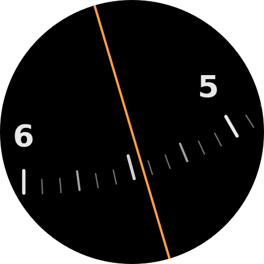
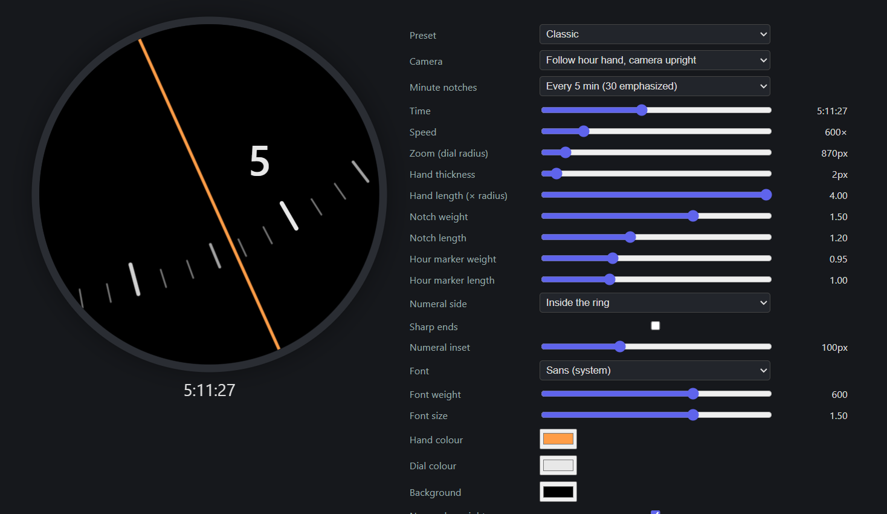

# pixel-watchface-builder

Zoomed hour-hand watch face for Pixel Watch 2 (Watch Face Format XML, no code).

## Examples

### Watch face

<p align="center">
  
</p>

### Web UI simulator



## Iterate

```sh
open demo.html                        # tune the design in the browser
# edit presets.js (shared by demo + generator)
bun tools/generate-watchface.tsx  # all presets as an on-watch style picker
./gradlew assembleDebug
adb install -r app/build/outputs/apk/debug/app-debug.apk
```

Then long-press the watch face on the watch to re-select it.

## Connect to watch

Watch: Settings → Developer options → Wireless debugging → note IP:port.

```sh
adb pair <ip>:<pairing-port>          # first time only
adb connect <ip>:<port>
adb -s <ip>:<port> install -r ...     # if "more than one device"
```

## Files

- `presets.js` — all design presets, single source of truth
- `demo.html` — browser simulator (`demo.md` explains the concept)
- `tools/generate-watchface.tsx` — presets → `app/src/main/res/raw/watchface.xml`
- `tools/xjsx/` — 50-line JSX runtime that renders the tags above straight to XML (not React)
